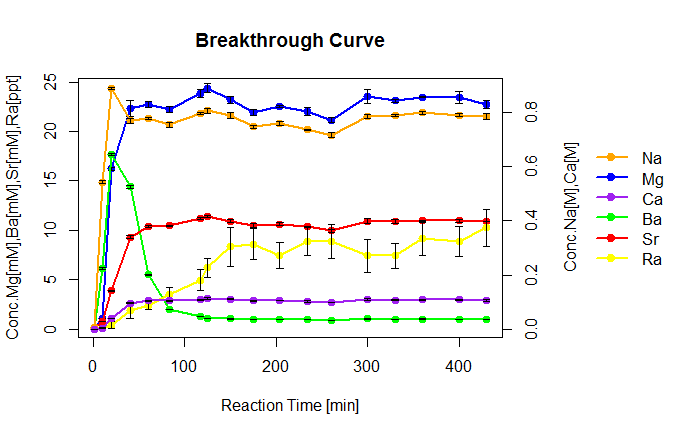
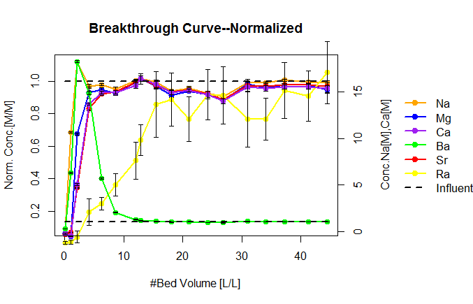

Final
========

### Introduction  
This is the final project for course "Microbial Informatics" at the University of Michigan. The goal of this project is develop a program that could be useful.       
My idea for project is related to my independent study on Radium removal by ion-exchange resins. I run several column tests, and sample of the effluent. Then the collected samples will run on ICP-MS, which is a type of mass spectrometry that is capable of detecting metals and several non-metals at very low concentrations. When I get the raw data from ICP-MS, I have to plot the data, and calculate the ion-exchange capacity of the resins for different chemial elements. The form of ICP-MS output data is Microsoft Excel. Files include sample number, reaction time, flow rate, dilution1, dilution2 and the concentratoin and RSD of tested chemical elements, which include Na, Mg, Ca, Sr, Ba and Ra. So the objective of this project is to create a program that could plot breakthrough curve and calculate ion-exchange capacity.

### How to use
This instruction is for Windows.          
1.Install packages          
Package `final` could be downloaded from [GitHub](https://github.com/hzhang2014).       


```R
####First install `devtools`, a collection of package development tools####
install.packages("devtools")
####load `devtools`####
library(devtools)
####Install `final` from github####
install_github("final","hzhang2014")
####Install `xlsx`, a package to read, write and format Excel files####
install.packages("xlsx")
####Install `Hmisc`, a package contains functions for data analysis. This package will be used to generate error bar in the plot.####
install.packages("Hmisc")
```

2.Load packages
```R
library(final)
library(xlsx)
library(Hmisc)
```

3.Use packages       
There are three functions included in the package:        

* `breakthrough` is the function to create breakthrough curve.       
**input**: file_name.xlsx         
**output**: figure        
**Example**: 
```R
breakthrough("Radium.xlsx")
```
      
*Note:*      
To go through with this example, you need to download [Radium.xlsx](https://github.com/hzhang2014/final/blob/master/Radium.xlsx) file in your working directory.

* `breakthrough.norm` is the function to create a breakthrough curve with normalized x-axis and y-axis.         
**input**: file_name.xlsx, bed volume of the resin in *ml*          
**output**: figure     
**Example**: 
```R
breakthrough("Radium.xlsx",12)
```

* `capacity` is the function to calculate ion-exchange capacity of a certain chemical element.           
**input**: file_name.xlsx, weight of resin in *g*, element interested          
**output**: a complete sentense     
**Example**: 
```R
capacity("Radium.xlsx",9.6,"Ra")
```
```R
[1] "Ion-exchange capacity for Ra is 0.15391919900722 nCi/g"
```
  
           
#####Note:        
You can track (and contribute to) development of `final` at [https://github.com/hzhang2014/final](https://github.com/hzhang2014/final).            
Any comments are welcomed.